<div align="center">

<!-- Animated Header -->


<!-- Typing SVG -->
<p align="center">
  <a href="https://git.io/typing-svg">
    
  </a>
</p>

<!-- Social Badges with Animation -->
<p align="center">
  <a href="https://www.linkedin.com/in/sahil-gabani-067964228/">
    
  </a>
  <a href="https://www.upwork.com/freelancers/sahilg65">
    
  </a>
  <a href="https://github.com/sahilGABANI">
    
  </a>
</p>

<!-- Profile Views & Stats -->
<p align="center">
  
  
  
</p>

</div>

---

## 🚀 About Me

```kotlin
class AndroidDeveloper {
    val name = "Sahil Gabani"
    val location = "Surat, Gujarat, India 🇮🇳"
    val experience = "3+ Years"
    val role = "Android App Developer"
    
    val expertise = mapOf(
        "Languages" to listOf("Kotlin", "Java"),
        "UI" to listOf("Jetpack Compose", "XML Layouts"),
        "Architecture" to listOf("MVVM", "MVC", "Clean Architecture"),
        "Backend" to listOf("Firebase", "REST APIs", "GraphQL")
    )
    
    val passions = listOf(
        "Building scalable mobile applications",
        "Writing clean, maintainable code",
        "Exploring new Android technologies",
        "Contributing to open source"
    )
    
    val currentlyLearning = listOf(
        "Kotlin Multiplatform Mobile (KMM)",
        "Compose Multiplatform",
        "Advanced Coroutines & Flow",
        "Java Backend Development"
    )
    
    fun getMotivation(): String {
        return "Turning caffeine ☕ into code 💻 and ideas 💡 into apps 📱"
    }
    
    fun sayHi() {
        println("👋 Thanks for visiting! Let's build something amazing together! 🚀")
    }
}
```

<div align="center">

### 💼 Professional Highlights

🎯 **3+ Years** of crafting exceptional Android experiences  
📱 Specialized in **Kotlin & Jetpack Compose**  
🏆 Expert in building **scalable & maintainable** applications  
⚡ Passionate about **clean code** and **modern architecture**  
🌟 Committed to delivering **pixel-perfect** user interfaces  
🔥 Successfully delivered **20+ production applications**

</div>

---

## 🛠️ Tech Stack

<div align="center">

### Core Technologies

<table>
<tr>
<td align="center" width="25%">
<h3>💻 Languages</h3>
<br/>
<br/>

</td>
<td align="center" width="25%">
<h3>🎨 UI Frameworks</h3>
<br/>
<br/>

</td>
<td align="center" width="25%">
<h3>🏗️ Architecture</h3>
<br/>
<br/>

</td>
<td align="center" width="25%">
<h3>🔧 Tools</h3>
<br/>
<br/>

</td>
</tr>
</table>

### Libraries & Dependencies

<table>
<tr>
<td align="center" width="33%">
<h4>⚡ Async & DI</h4>


</td>
<td align="center" width="33%">
<h4>🌐 Networking</h4>


</td>
<td align="center" width="33%">
<h4>💾 Data & Storage</h4>


</td>
</tr>
</table>

### Backend & Integration Services

<table>
<tr>
<td align="center" width="20%">
<h4>🔥 Firebase</h4>


</td>
<td align="center" width="20%">
<h4>🔐 Authentication</h4>


</td>
<td align="center" width="20%">
<h4>💳 Payments</h4>


</td>
<td align="center" width="20%">
<h4>🗺️ Maps & Location</h4>


</td>
<td align="center" width="20%">
<h4>🧪 Testing & CI/CD</h4>


</td>
</tr>
</table>

</div>

---

## 📊 GitHub Statistics

<div align="center">

<!-- Comment out until images load properly


-->

### 📈 Contribution Activity


**Note:** GitHub statistics widgets are temporarily disabled due to loading issues. Working on fixing them!

</div>

---

<!-- GitHub Trophies section hidden due to loading issues
## 🏆 GitHub Trophies

<div align="center">
  
[](https://github.com/ryo-ma/github-profile-trophy)

</div>

---
-->

## 💼 What I Bring to the Table

<div align="center">

<table>
<tr>
<td width="50%" valign="top">

### 🎨 UI/UX & Design
- ✨ Pixel-perfect UI implementation
- 🎯 Material Design 3 guidelines
- 🚀 Jetpack Compose expertise
- 📱 Responsive & adaptive layouts
- 🌈 Custom animations & transitions
- 🎭 Dark mode & theme support
- 🖼️ Vector graphics & illustrations
- 📐 Constraint & Motion layouts

</td>
<td width="50%" valign="top">

### 🏗️ Architecture & Quality
- 🏛️ Clean Architecture principles
- 📐 SOLID design patterns
- 🧩 Modular code structure
- 🧪 Unit & UI testing (TDD)
- 🔄 CI/CD pipeline integration
- 📊 Performance optimization
- 🐛 Debugging & crash analytics
- 📝 Code documentation

</td>
</tr>
<tr>
<td width="50%" valign="top">

### 🔐 Backend & Integration
- 🔒 OAuth & social authentication
- 💳 Payment gateway integration
- 🔔 Push notification services
- 🗺️ Location-based services
- ☁️ Firebase ecosystem
- 🌐 RESTful API integration
- 📡 WebSocket & real-time data
- 💾 Local & remote data sync

</td>
<td width="50%" valign="top">

### 🤝 Professional Skills
- 📋 Agile/Scrum methodology
- 🎯 Clear & timely communication
- 📝 Comprehensive documentation
- 🔄 Git workflow best practices
- ⏰ On-time project delivery
- 👥 Team collaboration
- 🎓 Mentoring junior developers
- 🔍 Code review expertise

</td>
</tr>
</table>

</div>

---

## 🎯 Development Approach

<div align="center">

### My Development Workflow

```mermaid
graph TD
    A[📋 Requirements Analysis] --> B[🎨 UI/UX Design]
    B --> C[🏗️ Architecture Planning]
    C --> D[💻 Development]
    D --> E[🧪 Testing]
    E --> F{✅ Quality Check}
    F -->|Pass| G[🚀 Deployment]
    F -->|Fail| D
    G --> H[📊 Monitoring]
    H --> I[🔄 Feedback & Iteration]
    I --> A
    
    style A fill:#ff6b6b,stroke:#c92a2a,color:#fff
    style B fill:#4ecdc4,stroke:#087f5b,color:#fff
    style C fill:#45b7d1,stroke:#0b7285,color:#fff
    style D fill:#96ceb4,stroke:#2f9e44,color:#fff
    style E fill:#ffeaa7,stroke:#f59f00,color:#000
    style F fill:#dfe6e9,stroke:#495057,color:#000
    style G fill:#74b9ff,stroke:#1864ab,color:#fff
    style H fill:#a29bfe,stroke:#5f3dc4,color:#fff
    style I fill:#fd79a8,stroke:#c2255c,color:#fff
```



</div>

---

## 🌟 Core Competencies

<div align="center">

| 💻 Technical Skills | 🎯 Soft Skills | 🚀 Specializations |
|:---:|:---:|:---:|
| Kotlin & Java | Problem Solving | Jetpack Compose |
| Android SDK | Communication | Material Design |
| Jetpack Libraries | Team Collaboration | Performance Optimization |
| Clean Architecture | Time Management | Firebase Integration |
| REST APIs | Adaptability | Custom UI Components |
| Git & Version Control | Critical Thinking | State Management |

</div>

---

## 📱 App Development Expertise

<div align="center">

### 🎯 Types of Apps I Build

<table>
<tr>
<td width="33%" align="center">

### 🛒 E-Commerce
- Shopping apps
- Product catalogs
- Payment integration
- Order tracking
- Wishlist & cart

</td>
<td width="33%" align="center">

### 📱 Social Media
- User profiles
- News feeds
- Chat & messaging
- Media sharing
- Notifications

</td>
<td width="33%" align="center">

### 🏥 Healthcare
- Appointment booking
- Patient records
- Telemedicine
- Health tracking
- Medication reminders

</td>
</tr>
<tr>
<td width="33%" align="center">

### 🎓 Education
- Learning platforms
- Course management
- Video streaming
- Quiz & assignments
- Progress tracking

</td>
<td width="33%" align="center">

### 🍔 Food Delivery
- Restaurant listings
- Menu browsing
- Order placement
- Real-time tracking
- Reviews & ratings

</td>
<td width="33%" align="center">

### 💼 Business
- CRM systems
- Task management
- Analytics dashboards
- Team collaboration
- Document management

</td>
</tr>
</table>

</div>

---

## 💡 Fun Facts About Me

<div align="center">

```kotlin
val funFacts = mapOf(
    "☕ Fuel" to "Coffee (lots of it!)",
    "🌙 Peak Productivity" to "Late night coding sessions",
    "📚 Always Learning" to "New Android APIs & libraries",
    "🎮 Inspiration Source" to "Gaming UI/UX designs",
    "🎵 Coding Companion" to "Music & podcasts",
    "🏃‍♂️ Debug Method" to "Take a walk, come back with solutions",
    "🎨 Design Philosophy" to "Less is more, but make it pop!",
    "🚀 Dream Project" to "Building apps that change lives"
)

funFacts.forEach { (key, value) -> 
    println("$key → $value")
}
```

</div>

---

## 📚 Latest Blog Posts & Articles

<div align="center">

<!-- BLOG-POST-LIST:START -->
- 🚀 Building Modern Android Apps with Jetpack Compose
- 🏗️ Clean Architecture in Android: A Practical Guide
- ⚡ Kotlin Coroutines: From Basics to Advanced
- 🎨 Material Design 3: What's New for Android Developers
- 🔥 Firebase vs Supabase: Choosing the Right Backend
<!-- BLOG-POST-LIST:END -->

➡️ [Read more articles...](https://medium.com/@sahilgabani)

</div>

---

## 🎓 Certifications & Achievements

<div align="center">

🏆 **Android Developer Certification**  
📜 **Kotlin Certified Developer**  
⭐ **5 Star Rating on Upwork**  
🌟 **Top Rated Plus Freelancer**  
🎯 **100% Job Success Score**  
💯 **20+ Successful Projects Delivered**

</div>

---

## 📊 Weekly Development Breakdown

```text
Kotlin             18 hrs 30 mins  ████████████████░░░░░   46.25%
Java Backend        7 hrs 45 mins   ████░░░░░░░░░░░░░░░░   19.37%
XML                 5 hrs 20 mins   ███░░░░░░░░░░░░░░░░░   13.33%
Gradle              3 hrs 15 mins   ██░░░░░░░░░░░░░░░░░░    8.12%
JSON                2 hrs 30 mins   █░░░░░░░░░░░░░░░░░░░    6.25%
Other               2 hrs 40 mins   █░░░░░░░░░░░░░░░░░░░    6.68%
```

---

## 📫 Let's Connect & Collaborate!

<div align="center">

### 💬 I'm always excited to work on innovative Android projects!

Whether you need a new app built from scratch or want to enhance an existing one,  
I'm here to bring your vision to life with clean code and exceptional user experience.

<p>
  <a href="https://www.linkedin.com/in/sahil-gabani-067964228/">
    
  </a>
  <a href="https://www.upwork.com/freelancers/sahilg65">
    
  </a>
  <a href="mailto:sahilgabani.dev@gmail.com">
    
  </a>
</p>

### 📧 Email: sahilgabani.dev@gmail.com
### 📱 Location: Surat, Gujarat, India 🇮🇳

</div>

---

## 💼 Open for Opportunities

<div align="center">

<table>
<tr>
<td align="center" width="50%">

### 🚀 Available For

✅ **Freelance Projects**  
✅ **Contract Work**  
✅ **Full-time Positions**  
✅ **Consulting**  
✅ **Open Source Contributions**  
✅ **Technical Writing**

</td>
<td align="center" width="50%">

### 📋 Preferred Projects

🎯 **Greenfield Android Apps**  
🔄 **App Modernization**  
🏗️ **Architecture Refactoring**  
🚀 **Performance Optimization**  
🎨 **UI/UX Implementation**  
🔧 **API Integration**

</td>
</tr>
</table>

### 💡 Ready to discuss your next Android project?

**Let's turn your ideas into reality!** 🚀

</div>

---

## 🌐 Find Me Around the Web

<div align="center">

[](https://www.linkedin.com/in/sahil-gabani-067964228/)
[](https://www.upwork.com/freelancers/sahilg65)
[](https://github.com/sahilGABANI)
[](https://stackoverflow.com/)
[](https://twitter.com/)
[](https://medium.com/)
[](https://dev.to/)
[](https://yourportfolio.com)

</div>

---

<div align="center">

### ⭐ From [sahilGABANI](https://github.com/sahilGABANI)

**Made with ❤️ and lots of ☕**

</div>

<!-- Animated Footer -->

