<div align="center">

<!-- Animated Header -->


<!-- Typing SVG -->
<p align="center">
  <a href="https://git.io/typing-svg">
    
  </a>
</p>

<!-- Social Badges -->
<p align="center">
  <a href="https://www.linkedin.com/in/sahil-gabani-067964228/">
    
  </a>
  <a href="https://www.upwork.com/freelancers/sahilg65">
    
  </a>
  <a href="https://github.com/sahilGABANI">
    
  </a>
  <a href="mailto:sahilgabani.dev@gmail.com">
    
  </a>
</p>

<!-- Profile Stats -->
<p align="center">
  
  
  
</p>

</div>

---

## 👋 About Me

```kotlin
class AndroidDeveloper {
    val name = "Sahil Gabani"
    val location = "Surat, Gujarat, India 🇮🇳"
    val experience = "3+ Years"
    val role = "Android App Developer"
    
    val expertise = listOf(
        "Kotlin & Jetpack Compose",
        "Clean Architecture & MVVM",
        "Firebase & REST APIs",
        "Material Design 3"
    )
    
    fun getMotivation() = "Turning caffeine ☕ into code 💻 and ideas 💡 into apps 📱"
}
```

🎯 **3+ Years** crafting exceptional Android experiences  
📱 Specialized in **Kotlin & Jetpack Compose**  
🏆 **20+ production applications** delivered  
⚡ Passionate about **clean code** and **modern architecture**

---

## 🛠️ Tech Stack

**Core**
- Kotlin, Java, Jetpack Compose, XML Layouts
- MVVM, Clean Architecture, Dependency Injection
- Android Studio, Git, Gradle

**Libraries**
- Coroutines & Flow, Hilt, Dagger, Koin
- Retrofit, OkHttp, Room Database, DataStore
- Material Design 3, Constraint Layout, Motion Layout

**Backend & Services**
- Firebase (Auth, Firestore, Cloud Storage, FCM, Crashlytics)
- OAuth 2.0, JWT, Google Sign-In
- Razorpay, Stripe, PayPal, In-App Billing
- Google Maps SDK, Places API
- JUnit, Espresso, Mockito, GitHub Actions

---

## 💼 What I Offer

**Development**
- Native Android apps with modern architecture
- Pixel-perfect Material Design 3 UI
- Payment gateway & authentication integration
- Real-time features & push notifications
- Performance optimization & testing

**Expertise**
- E-Commerce & Shopping Apps
- Social Media & Messaging
- Healthcare & Telemedicine
- Education & Learning Platforms
- Food Delivery & Business Apps

---

## 📊 GitHub Stats

<div align="center">
  
  
</div>

---

## 🎯 Development Workflow

```mermaid
graph LR
    A[📋 Requirements] --> B[🎨 Design]
    B --> C[💻 Development]
    C --> D[🧪 Testing]
    D --> E[🚀 Deployment]
    E --> F[📊 Monitoring]
    
    style A fill:#ff6b6b,stroke:#c92a2a,color:#fff
    style B fill:#4ecdc4,stroke:#087f5b,color:#fff
    style C fill:#96ceb4,stroke:#2f9e44,color:#fff
    style D fill:#ffeaa7,stroke:#f59f00,color:#000
    style E fill:#74b9ff,stroke:#1864ab,color:#fff
    style F fill:#a29bfe,stroke:#5f3dc4,color:#fff
```



---

## 🏆 Achievements

⭐ **Top Rated Plus** on Upwork | 🎯 **100% Job Success** Score  
📜 **Android & Kotlin** Certified | 💯 **20+ Projects** Delivered

---

## 💼 Open for Work

✅ Freelance Projects | ✅ Contract Work | ✅ Full-time Positions  
✅ Consulting | ✅ Open Source | ✅ Technical Writing

**Let's build something amazing together!** 🚀

---

## 📫 Contact

📧 **Email:** sahilgabani.dev@gmail.com  
📍 **Location:** Surat, Gujarat, India  
💼 **LinkedIn:** [Sahil Gabani](https://www.linkedin.com/in/sahil-gabani-067964228/)  
🌐 **Upwork:** [Top Rated Profile](https://www.upwork.com/freelancers/sahilg65)

---

<div align="center">

### ⭐ From [sahilGABANI](https://github.com/sahilGABANI)
**Made with ❤️ and lots of ☕**

</div>
